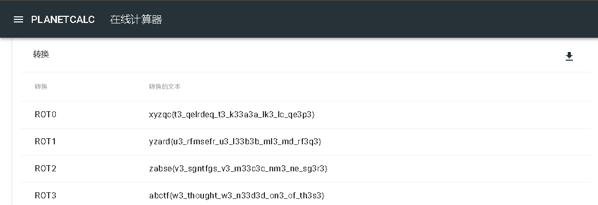
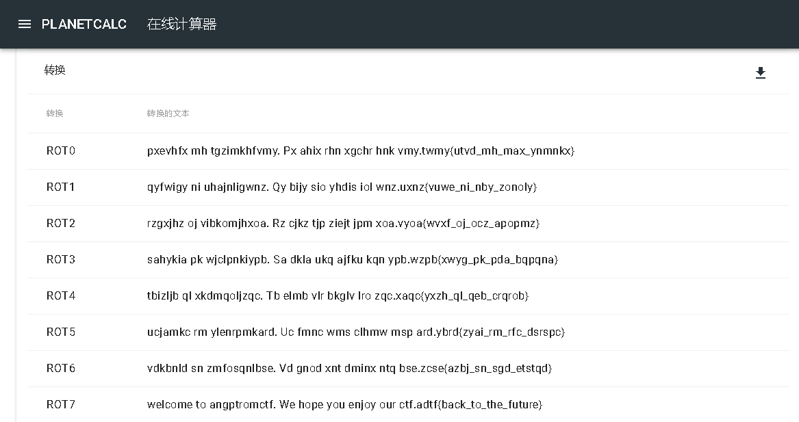
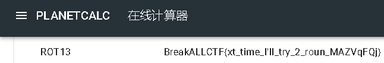
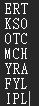
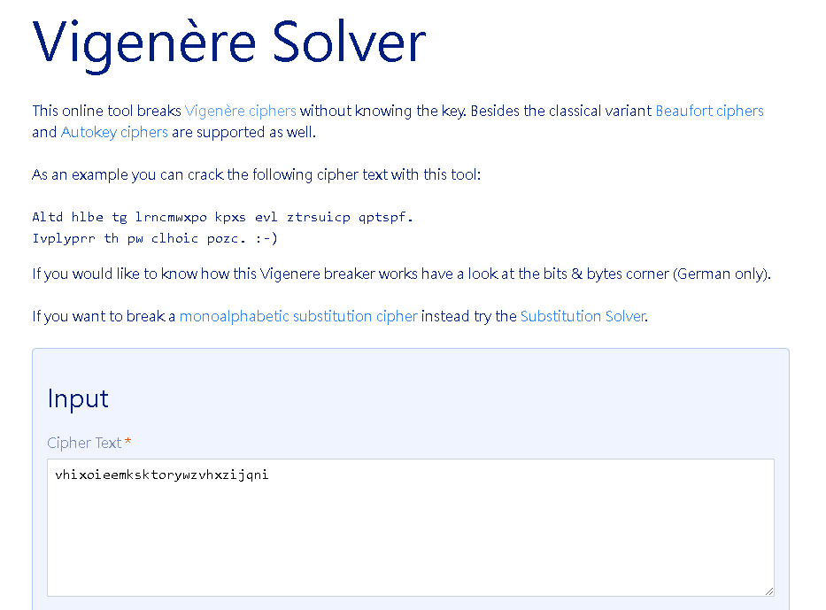
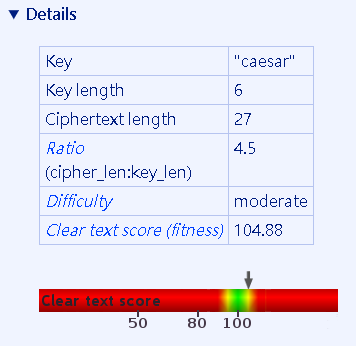
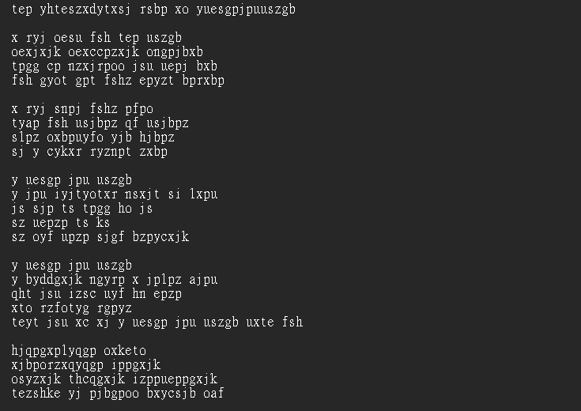
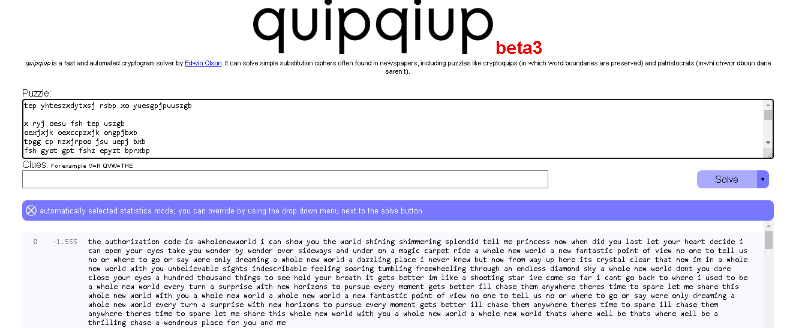
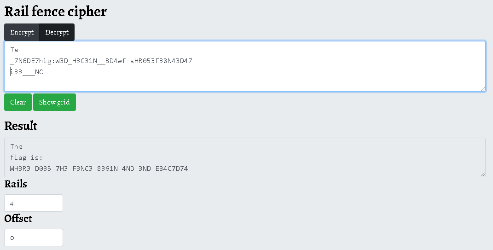
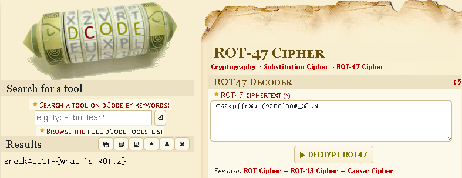

# SecurityFocusOnline CTF Write-ups (Crypto101)
## 第一題 
**底下是加密過的密文(ciphertext)**
    
**xyzqc{t3_qelrdeq_t3_k33a3a_lk3_lc_qe3p3}**

**你可以解密她嗎?**

**本題來自國外ABCTF的題目**

使用[線上解碼器](<http://example.com/Hello World.html> "Title")直接列出凱薩所有位移量，題目又說這是ABCTF的題目，所以Flag標題一定有abctf，就可以在ROT3找到Flag

## 第二題 凱撒密碼part2
**pxevhfx mh tgzimkhfvmy. Px ahix rhn xgchr hnk vmy.twmy{utvd_mh_max_ynmnkx}.**

**線上解題需特別注意有那些沒有被處理**

一樣使用剛剛的[線上解碼器](<http://example.com/Hello World.html> "Title")解出，密文有標點符號，所以先推測答案會是一句話，就在ROT7找到一句可閱讀的話

## 第三題 ROT13
**ROT13的?秘
OernxNYYPGS{kg_gvzr_V'yy_gel_2_ebha_ZNMIdSDw}**

阿都已經說ROT13了，就直接Google ROT13解碼器就好了，我因為知道他是凱薩密碼，所以就繼續用鋼剛的[線上解碼器](<http://example.com/Hello World.html> "Title")

## 第四題 密碼棒破解
**Decrypt this strange word: ERT KSOOTCMCHYRAFYLIPL**

**本?目來自國外EKOPARTYCTF的題目，解答也就會有相關文字**

題目說解答會有EKOPARTYCTF的相關文字，所以先試著讓第一行出現EKO三個字，再用直的方式由左而右閱讀，就是Flag了

## 第五題  Vigenere cipher
**Crack the cipher: vhixoieemksktorywzvhxzijqni**

**Your clue is:**
**"caesar is everything. But he took it to the next level."Vigenere cipher**
**參考看看:https://www.guballa.de/vigenere-solver**

直接使用題目給你的解碼器用，就可以解出來

他還會幫你把key找出來

## 第六題 頻率分析法
**There's an authorization code for scme Thyrin Labs information here,along with somecne's favorite song. But it's been encrypted:Find the authorization code.**

**Hint:You may want to look at what the relative frequencles of
letters in english text are.**

**底下網站有用：http://quipqiup.com/**

直接把txt檔案丟到題目給你的解碼器

越上面代表答案越可能，然後題目說要找authorization code，所以就看文中the authorization code is awholenewworld，就找到答案了
## 第七題 Rail Fence Cipher
**你會Rail Fence Cipher 笆式位移密碼嗎?**
**解底下?目吧!密文如下:

Ta

_7N6DE7hlg:W3D_H3C31N__BD4ef sHR053F38N43D47
i33___NC
使用四層籬笆(rail fence with4 rails)
答案格式:BreakAIICTF{flag}
https://www.dcode.fr/rail-fence-cipher**

直接用rail fence decorder 解開
## 第八題 ROT47
你知道下列文字如何解密嗎?
qC62<p{{r%uL(92E0ˋD0#_%]KN
上網去GOOGLE ROT47
主動學習:請說明其原理

直接上網搜尋ROT47解碼