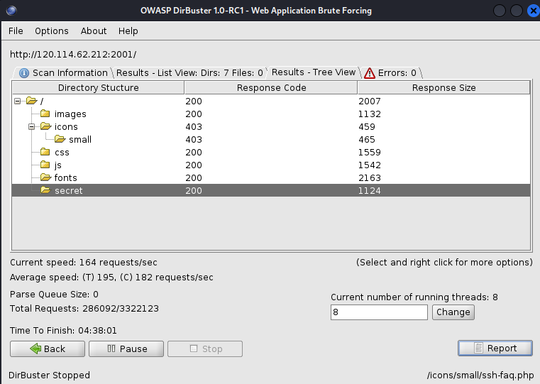
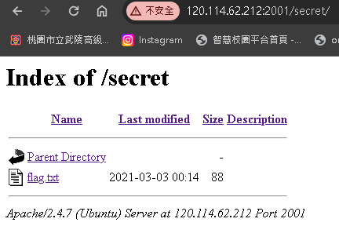
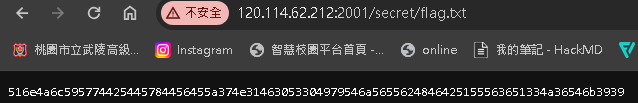
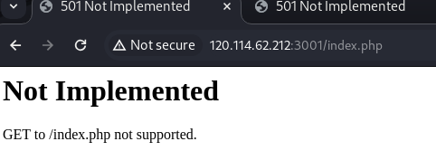
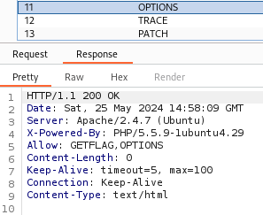
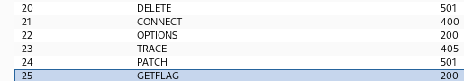
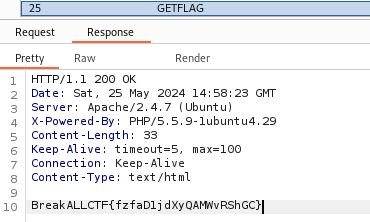

## Web-1:source code
在瀏覽器按下F12打開開發人員選項
## web-2: Easy_Robots.txt
就這樣

## web-3:Robots.txt
要找出Robot.txt，但是直接用第二題的方法不可行，所以我先暴力破解網站目錄，發現神奇的secret資料夾

果然Flag就在這裡

題目有提示[相關hex to string及base64 編碼] 所以就用解碼器去解碼
## web-5:HTTP method
預設的GET無法進入網站

懶得一個一個試直接用Burpsuite去payload看哪種方法行，發現OPTIONS回傳是正常的200，剛好OPTION就是可以看那些Request方法可以

OPTIONS的Response裡有一種奇怪的方法是GETFLAG，所以把GETFLAG加到我的payload wordlist裡再去payload

GETFLAG回傳的是200正常執行的Statues code和 FLAG!
