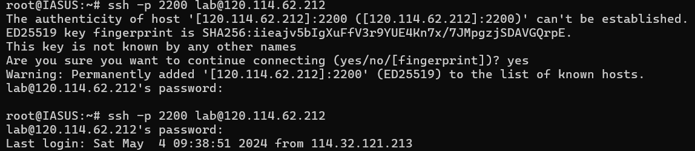
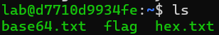
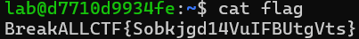
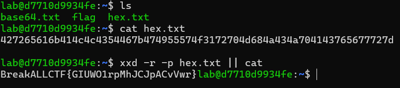
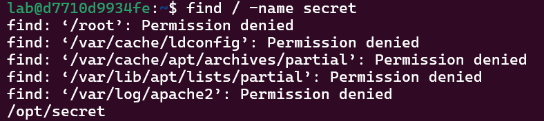
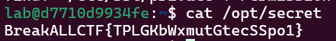
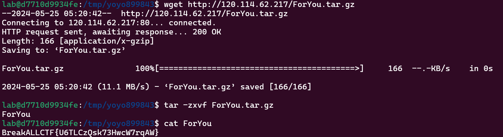
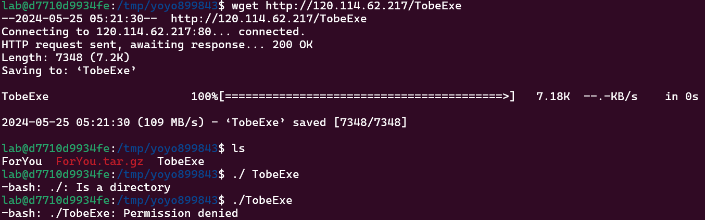
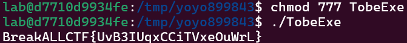

## linux CTF 1
直接連接遠端伺服器再把flag檔案叫出來

## linux CTF 2
ls的進階用法

## linux CTF 3
xxd 的用法

## linux CTF 4
base64 的用法

## linuc CTF 5

## linux CTF 8

## linux CTF 9
使用wget下載檔案

再用chmod 777 提升權限 就可以./執行 

##  
